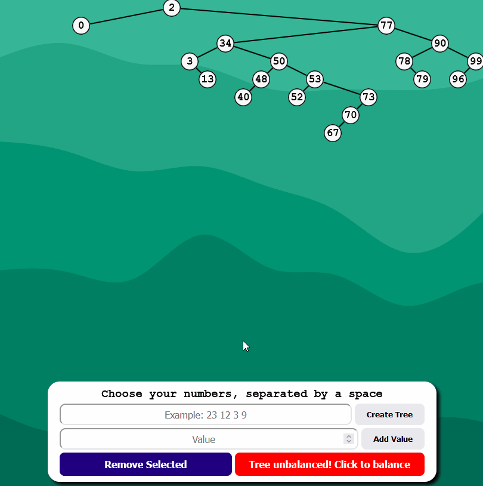
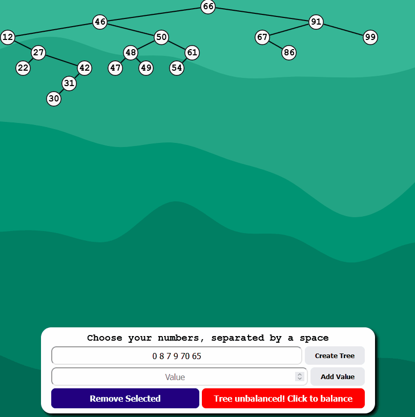
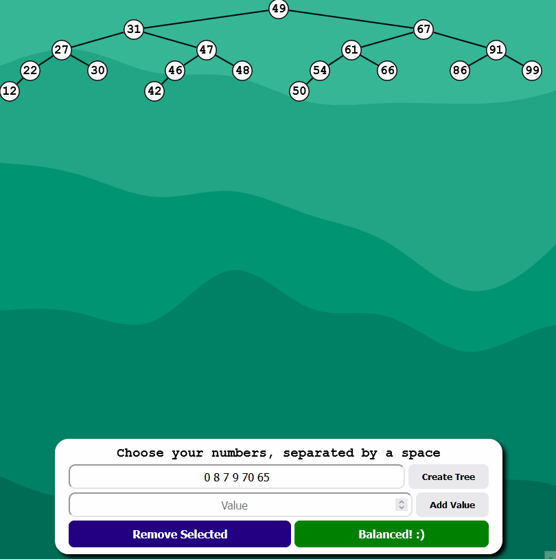
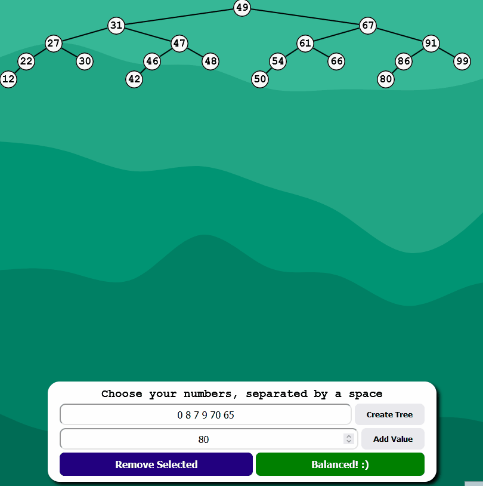

# <a href="https://mclilzee.github.io/binary-tree-ts">Binary Search Tree</a>

Were you looking for yet another binary tree virtualization website? you came to the right place.
In this Binary Search Tree Application, you will be able to create, add, remove, and balance the tree.

The tree will start with 20 default numbers between 0 and 99.
It will most likely be unbalanced, unless you get lucky with randomization! from there you will be able to create a new tree, or append numbers to it, maybe balance it if you wish to! I will leave it to your imagination.

# Examples

### Creating new tree

### Balancing unbalanced tree

### Adding new values

### Removing values

# Credits
Background Wave pattern using SVG from <a href="https://app.haikei.app">Haikei App</a>
